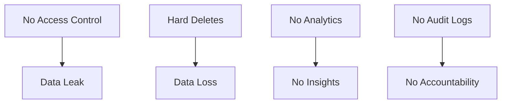
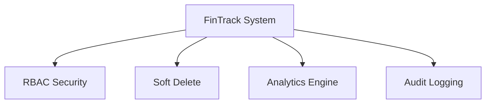
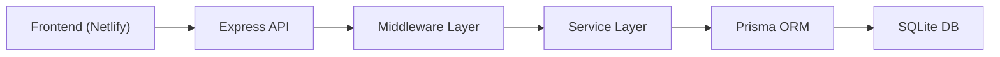
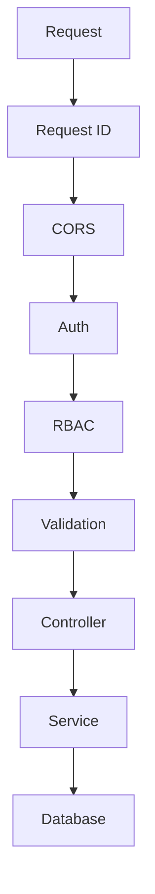
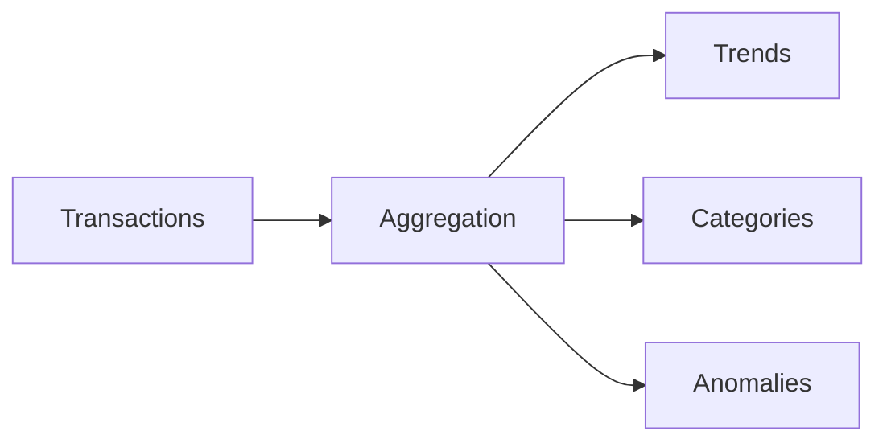

# 🚀 FinTrack — RBAC Finance System

> Production-grade **finance backend + analytics dashboard** with  
> 🔐 RBAC · 📊 Analytics · ⚡ Anomaly Detection · 🧾 Audit Logging

---

## 🔗 Live Links

- 🌐 Frontend: https://creative-crumble-894489.netlify.app/  
- 📚 API Docs: https://fintrack-rbac-api.onrender.com/api-docs  
- 💚 Health: https://fintrack-rbac-api.onrender.com/health  

---

## ⚠️ Important (Render Cold Start)

Backend sleeps on inactivity.

👉 Open first:
```
https://fintrack-rbac-api.onrender.com/health
```

Wait until:
```json
{"status":"ok"}
```

---

# 📌 Problem



---

# 💡 Solution



---

# ✨ Features

## 🔐 Authentication
- JWT access + refresh tokens  
- Token rotation  
- Secure session handling  

## 👥 RBAC
```
ADMIN > ANALYST > VIEWER
```

| Action | Viewer | Analyst | Admin |
|--------|--------|--------|-------|
| Read | ✅ | ✅ | ✅ |
| Create | ❌ | ✅ | ✅ |
| Delete | ❌ | ✅ | ✅ |
| Restore | ❌ | ❌ | ✅ |

---

## 💰 Transactions
- CRUD operations  
- Filtering + pagination  
- Soft delete + restore  
- CSV export  

---

## 📊 Analytics
- Monthly trends  
- Category breakdown  
- Weekly cash flow  

---

## ⚡ Anomaly Detection

```
z = (x - mean) / stdDev
```

If:
```
|z| > 2 → anomaly
```

Detects:
- Spending spikes  
- Outliers per category  

---

## 🧾 Audit Logs
- Tracks all actions  
- Immutable history  
- Includes user + timestamp  

---

# 🏗️ Architecture



---

# 🔄 Request Flow



---

# 📊 Analytics Pipeline



---

# 📁 Project Structure

```
fintrack-rbac-api/
│
├── src/
│   ├── app.ts
│   ├── config/
│   ├── middlewares/
│   ├── modules/
│   │   ├── auth/
│   │   ├── users/
│   │   ├── transactions/
│   │   ├── dashboard/
│   │   └── audit/
│   └── utils/
│
├── prisma/
│   ├── schema.prisma
│   └── seed.ts
│
├── package.json
└── tsconfig.json
```

---

# 🚀 Quick Start

```bash
git clone https://github.com/debasmita30/fintrack-rbac-api
cd fintrack-rbac-api

npm install
npx prisma generate

npx prisma db push
npx tsx prisma/seed.ts

npm run dev
```

---

# 🌐 API Overview

## Auth
- POST `/auth/login`
- POST `/auth/refresh`
- GET `/auth/me`

## Transactions
- GET `/transactions`
- POST `/transactions`
- DELETE `/transactions/:id`
- POST `/transactions/:id/restore`

## Dashboard
- GET `/dashboard/summary`
- GET `/dashboard/anomalies`

---

# 👤 Demo Credentials

| Role | Email | Password |
|------|------|---------|
| Admin | admin@fintrack.io | Password@123 |
| Analyst | analyst@fintrack.io | Password@123 |
| Viewer | viewer@fintrack.io | Password@123 |

---

# ☁️ Deployment

| Layer | Platform |
|------|--------|
| Backend | Render |
| Frontend | Netlify |
| Docs | Swagger |

---

# 🧠 Highlights

- RBAC enforced at API level  
- Soft delete for data safety  
- Real analytics (not dummy UI)  
- Full audit logging  
- Clean modular architecture  

---

# 👨‍💻 Author

Debasmita Chatterjee  
GitHub: https://github.com/debasmita30  

---

# ⭐ Star this repo if useful
