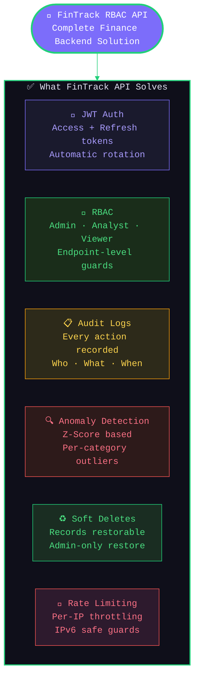
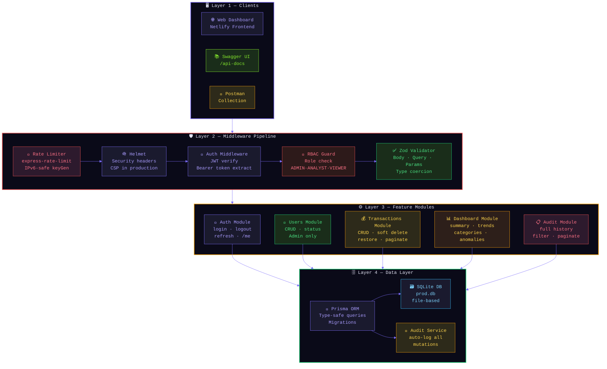
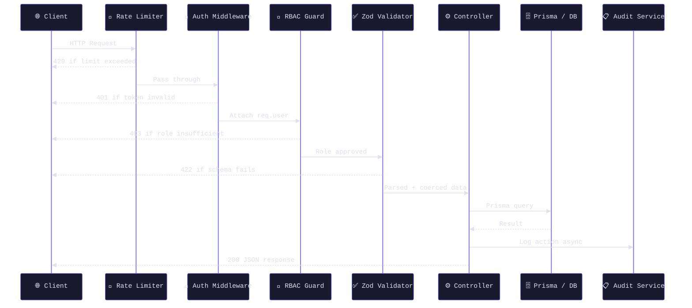
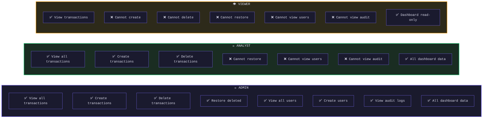
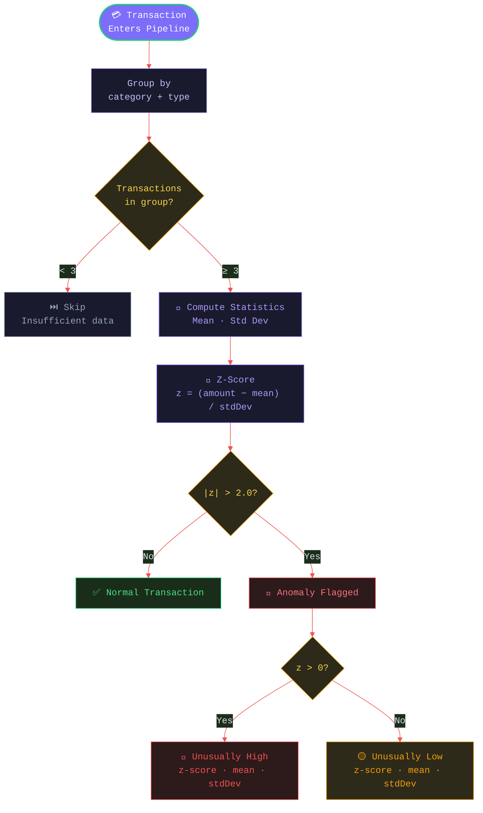
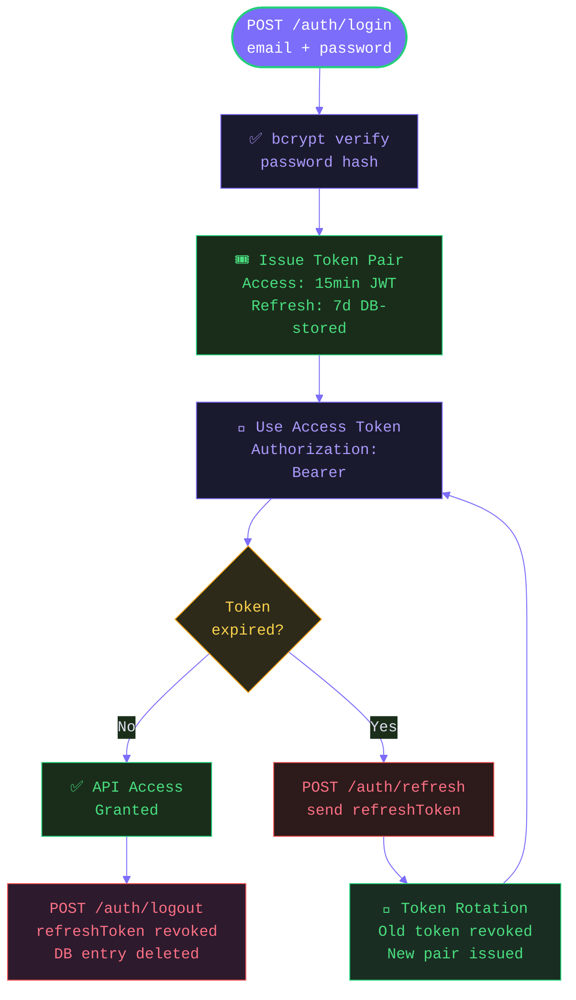

<div align="center">


<br/>


<br/><br/>

<a href="https://fintrack-rbac-api.onrender.com" target="_blank">
  
</a>
&nbsp;
<a href="https://fintrack-rbac-api.onrender.com/api-docs" target="_blank">
  
</a>
&nbsp;
<a href="https://creative-crumble-894489.netlify.app" target="_blank">
  
</a>

<br/><br/>


&nbsp;

&nbsp;

&nbsp;

&nbsp;


<br/><br/>


&nbsp;

&nbsp;

&nbsp;


<br/><br/>

> ⚠️ **Heads up — Render Free Tier Cold Start**
> The API is hosted on Render's free tier which **spins down after 15 minutes of inactivity**.
> If the dashboard shows a connection error, **[click here to wake the API](https://fintrack-rbac-api.onrender.com/health)**, wait ~30 seconds for it to boot, then refresh the dashboard.

<br/>


</div>

<br/>

## 📌 Quick Links

<div align="center">

| 🚀 [Live API](https://fintrack-rbac-api.onrender.com) | 📚 [Swagger Docs](https://fintrack-rbac-api.onrender.com/api-docs) | 🖥️ [Dashboard](https://creative-crumble-894489.netlify.app) |
|:---:|:---:|:---:|
| ❓ [Problem Statement](#-problem-statement) | 💡 [Solution](#-solution) | 🏗️ [Architecture](#-system-architecture) |
| ✨ [Features](#-features) | 🛠️ [Tech Stack](#%EF%B8%8F-tech-stack) | ⚡ [Quick Start](#-quick-start) |
| 🔐 [API Reference](#-api-reference) | 📁 [File Structure](#-file-structure) | 🧪 [Testing](#-testing) |

</div>

<br/>


<br/>

## ❓ Problem Statement

<div align="center">

```
Financial platforms handle sensitive multi-user data yet most backends
lack proper access control, audit trails, and behavioral anomaly detection.
```

</div>



```mermaid
%%{init: {'theme': 'base', 'themeVariables': {'primaryColor': '#1a1a2e', 'primaryTextColor': '#E0E0F0', 'primaryBorderColor': '#7C6DFA', 'lineColor': '#7C6DFA', 'secondaryColor': '#16213e', 'tertiaryColor': '#0f0f1a', 'background': '#0f0f1a', 'mainBkg': '#1a1a2e', 'nodeBorder': '#7C6DFA', 'clusterBkg': '#16213e', 'titleColor': '#E0E0F0', 'edgeLabelBackground': '#1a1a2e', 'fontFamily': 'monospace'}}}%%
flowchart LR
    subgraph PAIN ["🚨 The Pain Points"]
        direction TB
        A["🔓 No Access Control\nAll users see all data\nNo role segregation"]
        B["🪪 Weak Auth\nNo token rotation\nSessions never expire"]
        C["👻 No Audit Trail\nWho changed what?\nNo accountability"]
        D["📊 No Anomaly Detection\nFraudulent transactions\ngo unnoticed"]
        E["🗑️ Hard Deletes\nData lost forever\nNo recovery possible"]
    end

    subgraph IMPACT ["📉 Business Impact"]
        direction TB
        F["Data Breaches\nUnauthorized access"]
        G["Compliance Failure\nNo audit evidence"]
        H["Financial Fraud\nUndetected outliers"]
        I["Data Loss\nIrrecoverable records"]
    end

    PAIN --> IMPACT

    style A fill:#2d1a1a,stroke:#F05252,color:#FB7185
    style B fill:#2d2a1a,stroke:#F59E0B,color:#FCD34D
    style C fill:#1a2d1a,stroke:#22D07A,color:#4ADE80
    style D fill:#1a1a2d,stroke:#7C6DFA,color:#A89BFC
    style E fill:#2d1a2d,stroke:#F05252,color:#FB7185
    style F fill:#1a1a2e,stroke:#F05252,color:#F05252
    style G fill:#1a1a2e,stroke:#F59E0B,color:#F59E0B
    style H fill:#1a1a2e,stroke:#7C6DFA,color:#7C6DFA
    style I fill:#1a1a2e,stroke:#F05252,color:#F05252
    style PAIN fill:#0f0f1a,stroke:#F05252,stroke-width:2px,color:#E0E0F0
    style IMPACT fill:#0f0f1a,stroke:#7C6DFA,stroke-width:2px,color:#E0E0F0
```

| # | Problem | Impact |
|---|---------|--------|
| 🔓 | **No role segregation** — every user can read, write, and delete everything | Data leaks, unauthorized mutations |
| 🪪 | **Stateless token abuse** — access tokens never rotate or expire properly | Session hijacking, replay attacks |
| 👻 | **Zero audit trail** — no record of who performed which action and when | Compliance failure, no forensic trail |
| 📊 | **No anomaly detection** — unusual transactions blend in with normal ones | Financial fraud goes undetected |
| 🗑️ | **Destructive deletes** — records permanently lost with no recovery path | Data loss, no rollback capability |
| 🚦 | **No rate limiting** — APIs exposed to brute-force and DDoS attacks | Auth bypass, server overload |

<br/>

## 💡 Solution



FinTrack API is a **production-grade REST backend** built with TypeScript, Express 5, Prisma ORM, and SQLite. It implements enterprise-level RBAC with JWT authentication, full audit logging, z-score anomaly detection, soft deletes with restore, and comprehensive Swagger documentation — all tested with Jest + Supertest.

<br/>

## 🏗️ System Architecture



<br/>

### 🔄 Request Lifecycle



<br/>

### 🔐 RBAC Permission Matrix



<br/>

### 🔍 Anomaly Detection Logic



<br/>

### 🔑 JWT Token Flow



<br/>

## ✨ Features

<table>
<tr>
<td width="50%" valign="top">

### 🔐 Authentication & Security
- **JWT access tokens** (15-minute expiry) + **refresh tokens** (7-day, DB-stored)
- **Token rotation** — refresh invalidates old token immediately
- **bcrypt** password hashing with cost factor 12
- **Helmet** security headers + CORS with credential support
- **Per-IP rate limiting** with IPv6-safe key generation
- Inactive user accounts **blocked at login**

### 👥 Role-Based Access Control
- Three roles: **ADMIN · ANALYST · VIEWER**
- Enforced at middleware level — not just UI
- Admin-only: user management, audit logs, restore deleted records
- Analyst: full transaction CRUD
- Viewer: read-only access to own data

### 💰 Transactions
- Full **CRUD** with Zod schema validation
- **Soft delete** — records marked `isDeleted`, never destroyed
- **Admin-only restore** endpoint
- Pagination · sorting · filtering by type, category, search
- Future date rejection · negative amount rejection

</td>
<td width="50%" valign="top">

### 📊 Dashboard Analytics
- **Financial summary** — income, expenses, net balance, savings rate
- **Monthly trends** — 6-month income vs expense vs net chart data
- **Weekly cash flow** — rolling 4-week breakdown
- **Category breakdown** — top expense categories with totals
- **Recent activity** — last N transactions
- **Anomaly detection** — z-score outliers per category

### 📋 Audit Logging
- Every **CREATE · UPDATE · DELETE · RESTORE · LOGIN · LOGOUT** recorded
- Stores: action · entity · entityId · performedBy · IP · timestamp
- Filterable by action type and entity
- Paginated with full user context

### 🧪 Test Coverage
- **Jest + Supertest** integration tests
- Auth flows: login, refresh rotation, logout, invalid tokens
- Transaction RBAC: role-based 201/403 enforcement
- Dashboard: summary totals, date-range filtering, anomaly shape
- In-memory **SQLite test DB** — zero external dependencies

</td>
</tr>
</table>

<br/>

## 🛠️ Tech Stack

<div align="center">

| Layer | Technology | Purpose |
|-------|-----------|---------|
| **Language** |  | Type-safe backend |
| **Framework** |  | HTTP server & routing |
| **ORM** |  | Type-safe DB queries + migrations |
| **Database** |  | Lightweight production DB |
| **Auth** |  | Access + refresh token auth |
| **Validation** |  | Runtime schema validation |
| **Security** |  +  | Headers + password hashing |
| **Rate Limiting** | `express-rate-limit` | IPv6-safe per-IP throttling |
| **API Docs** |  | Interactive API documentation |
| **Testing** |  + `supertest` | Integration test suite |
| **Logging** | `morgan` | HTTP request logging |
| **Deployment** |  | Cloud hosting |

</div>

<br/>

## ⚡ Quick Start

```bash
# 1. Clone the repository
git clone https://github.com/debasmita30/fintrack-rbac-api.git
cd fintrack-rbac-api

# 2. Install dependencies
npm install

# 3. Set up environment variables
cp .env.example .env
# Edit .env with your values (see below)

# 4. Push DB schema + seed demo data
npx prisma db push
npm run db:seed

# 5. Start development server
npm run dev
```

Open **http://localhost:10000** — Swagger docs at **http://localhost:10000/api-docs**

<br/>

### 🔧 Environment Variables

```env
# Server
NODE_ENV=development
PORT=10000

# Database
DATABASE_URL="file:./dev.db"

# JWT Secrets — use long random strings in production
JWT_ACCESS_SECRET=your_access_secret_here
JWT_REFRESH_SECRET=your_refresh_secret_here
JWT_ACCESS_EXPIRES_IN=15m
JWT_REFRESH_EXPIRES_IN=7d

# Rate Limiting
RATE_LIMIT_WINDOW_MS=900000
RATE_LIMIT_MAX=100

# Frontend (for CORS in production)
FRONTEND_URL=https://your-frontend.netlify.app
```

<br/>

## 🔐 API Reference

### Test Credentials

| Role | Email | Password |
|------|-------|----------|
| 👑 Admin | `admin@fintrack.io` | `Password@123` |
| 🔬 Analyst | `analyst@fintrack.io` | `Password@123` |
| 👁️ Viewer | `viewer@fintrack.io` | `Password@123` |

<br/>

### Endpoints Overview

```
AUTH
  POST   /api/v1/auth/login          Public       Login → access + refresh tokens
  POST   /api/v1/auth/refresh        Public       Rotate refresh token
  POST   /api/v1/auth/logout         Auth         Revoke refresh token
  GET    /api/v1/auth/me             Auth         Get current user profile

TRANSACTIONS
  GET    /api/v1/transactions        Auth         List with pagination + filters
  POST   /api/v1/transactions        Analyst+     Create new transaction
  GET    /api/v1/transactions/:id    Auth         Get by ID
  PATCH  /api/v1/transactions/:id    Analyst+     Update transaction
  DELETE /api/v1/transactions/:id    Analyst+     Soft delete
  POST   /api/v1/transactions/:id/restore  Admin  Restore soft-deleted

DASHBOARD
  GET    /api/v1/dashboard/summary          Auth  Financial totals + savings rate
  GET    /api/v1/dashboard/trends/monthly   Auth  6-month income/expense/net
  GET    /api/v1/dashboard/trends/weekly    Auth  Rolling 4-week cash flow
  GET    /api/v1/dashboard/categories       Auth  Breakdown by category
  GET    /api/v1/dashboard/recent           Auth  Recent transactions
  GET    /api/v1/dashboard/anomalies        Auth  Z-score outlier detection

USERS                                       (Admin only)
  GET    /api/v1/users               Admin        List all users
  POST   /api/v1/users               Admin        Create user
  GET    /api/v1/users/:id           Admin        Get user by ID
  PATCH  /api/v1/users/:id           Admin        Update user role/status

AUDIT                                       (Admin only)
  GET    /api/v1/audit               Admin        Paginated audit log with filters
```

> 📚 Full interactive documentation with request/response schemas available at **[/api-docs](https://fintrack-rbac-api.onrender.com/api-docs)**

<br/>

## 📁 File Structure

```
fintrack-rbac-api/
│
├── 📄 src/
│   ├── app.ts                          # Express app — middleware + routes
│   │
│   ├── config/
│   │   ├── env.ts                      # Zod-validated environment config
│   │   └── swagger.ts                  # Swagger/OpenAPI spec builder
│   │
│   ├── middlewares/
│   │   ├── auth.ts                     # JWT verification + req.user injection
│   │   ├── rbac.ts                     # Role-based access control guard
│   │   ├── validate.ts                 # Zod schema validator (body/query/params)
│   │   ├── errorHandler.ts             # Global error handler → structured JSON
│   │   ├── rateLimiter.ts              # express-rate-limit (IPv6-safe)
│   │   └── requestId.ts                # UUID request ID injector
│   │
│   ├── modules/
│   │   ├── auth/
│   │   │   ├── auth.routes.ts          # POST login · refresh · logout · GET me
│   │   │   ├── auth.controller.ts      # Request handlers
│   │   │   ├── auth.service.ts         # Business logic + token management
│   │   │   └── auth.schema.ts          # Zod schemas for auth inputs
│   │   │
│   │   ├── users/
│   │   │   ├── user.routes.ts          # Admin CRUD endpoints
│   │   │   ├── user.controller.ts
│   │   │   ├── user.service.ts
│   │   │   └── user.schema.ts
│   │   │
│   │   ├── transactions/
│   │   │   ├── transaction.routes.ts   # CRUD + soft-delete + restore
│   │   │   ├── transaction.controller.ts
│   │   │   ├── transaction.service.ts
│   │   │   └── transaction.schema.ts
│   │   │
│   │   ├── dashboard/
│   │   │   ├── dashboard.routes.ts     # Summary · trends · anomalies
│   │   │   ├── dashboard.controller.ts
│   │   │   └── dashboard.service.ts    # Z-score anomaly detection engine
│   │   │
│   │   └── audit/
│   │       ├── audit.routes.ts         # Paginated audit log
│   │       ├── audit.controller.ts
│   │       └── audit.service.ts        # Async audit writer
│   │
│   └── utils/
│       └── ApiError.ts                 # Structured error class
│
├── 🗃️ prisma/
│   ├── schema.prisma                   # DB models: User · Transaction · AuditLog · RefreshToken
│   └── seed.ts                         # Demo data for all 3 roles
│
├── 🧪 tests/
│   ├── setup.ts                        # In-memory SQLite test DB setup
│   ├── auth.test.ts                    # Login · refresh rotation · logout
│   ├── transactions.test.ts            # RBAC · CRUD · soft-delete · restore
│   └── dashboard.test.ts               # Summary totals · anomaly shape
│
├── 📋 .env.example                     # Environment variable template
├── 📋 package.json
├── 📋 tsconfig.json
└── 📖 README.md
```

<br/>

## 🧪 Testing

```bash
# Run full test suite
npm test

# Run with coverage report
npm run test:coverage

# Watch mode
npm run test:watch
```

### Test Coverage

| Module | Tests | What's Covered |
|--------|-------|----------------|
| **Auth** | 10 tests | Login success/fail, refresh rotation, token revocation, logout, malformed tokens |
| **Transactions** | 12 tests | Role-based create/delete/restore, validation rejection, pagination, soft-delete visibility |
| **Dashboard** | 8 tests | Summary totals, date-range filtering, category breakdown, anomaly response shape |

> Tests use an isolated **in-memory SQLite database** — no external services needed, zero flakiness.

<br/>

## 🗺️ Roadmap

- [ ] 🐘 PostgreSQL support for production scale
- [ ] 📧 Email alerts on anomaly detection
- [ ] 🔔 Webhook support for transaction events
- [ ] 📊 CSV export for transactions
- [ ] 🔒 Two-factor authentication (TOTP)
- [ ] 🌍 Multi-tenant organization support

<br/>

## 🤝 Contributing

Contributions are welcome!

1. Fork the repository
2. Create your feature branch — `git checkout -b feature/AmazingFeature`
3. Commit your changes — `git commit -m 'Add AmazingFeature'`
4. Push to the branch — `git push origin feature/AmazingFeature`
5. Open a Pull Request

<br/>

---

<div align="center">


<br/>

**Built with ❤️ for production-grade backend engineering**

<br/>

[](https://fintrack-rbac-api.onrender.com)
&nbsp;
[](https://fintrack-rbac-api.onrender.com/api-docs)
&nbsp;
[](https://creative-crumble-894489.netlify.app)

<br/>

*If this project helped you, please give it a ⭐ — it means a lot!*

</div>
